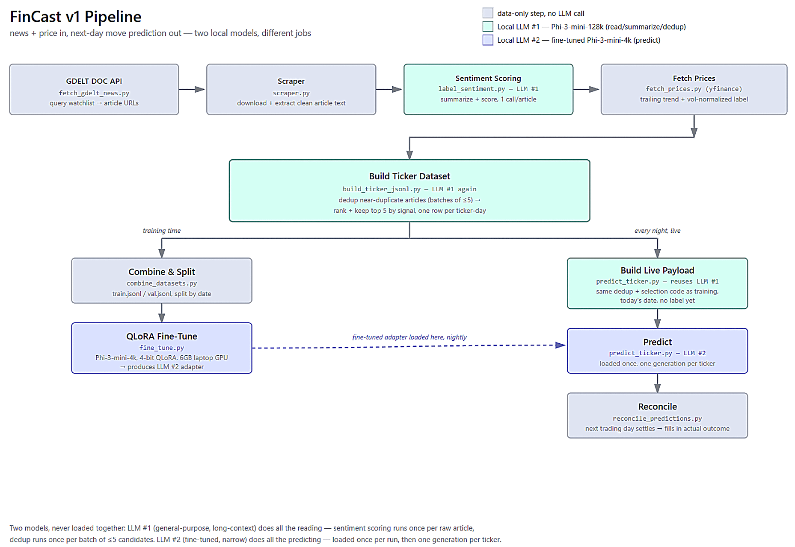
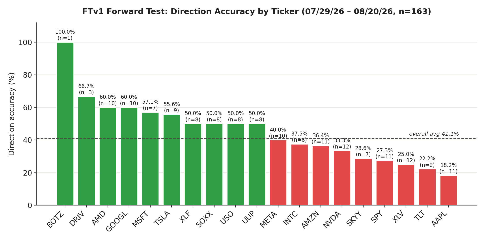

# FinCast: Fine-Tuning a Small Model to Predict Next-Day Stock Moves

## Section 1: Short Summary 
FinCast is an end‑to‑end pipeline that fine‑tunes a small open‑source LLM to predict next‑day stock movement from daily news and short‑term price context. This is built and run entirely on a laptop (Phi‑3‑mini, RTX 4050, 6GB VRAM). The repo contains data collection, dataset building, QLoRA fine‑tuning, nightly prediction, and reconciliation scripts.

The goal was the full pipeline: data collection → labeling → training → evaluation → live prediction — built from scratch, on hardware modest enough that every design decision had a real cost attached to it.

I picked financial domain to learn fine-tuning as fresh data arrives every single day, and the ground truth arrives the next morning. You collect, you predict, you get scored, you fix. That loop can run indefinitely and it doesn't care how confident you were, which makes it an honest teacher.

What actually surprised me is that this effort went somewhere at all. Mixing a handful of news articles with a few days of price history and fine-tuning a small open model on a gaming laptop produced a model that showed real, if narrow, directional signal which I was not confident that this scale of effort would produce. It hasn't seen full years data yet, so there's plenty still to prove before I'd trust it with anything. But this write-up is less about the finished model and more about learning by doing, trying to make honest sense of what the model's behavior was actually telling me at each step.

## Section 2: The Full Pipeline, End to End

Before getting into any one stage's story, it's worth seeing the whole shape of the thing — partly because the shape itself was a real design decision, not just plumbing.

Every night, four stages run in sequence to turn raw news into a labeled dataset: **GDELT's DOC API** returns article URLs for a watchlist of companies, sectors, and macro themes; a **scraper** downloads and extracts clean article text from each one; a **sentiment-scoring step** reads that text and produces a summary, a 1–5 sentiment score, and a direction; and a **price-fetch step** pulls each ticker's trailing trend and computes a volatility-normalized move label from Yahoo Finance. None of that last step touches a model at all — it's pure price math.

From there, **dataset building** is the one component that gets reused twice, in two very different contexts. Given a ticker and a date, it deduplicates near-duplicate articles covering the same underlying story, ranks what's left, and keeps the top 5 by signal strength. At training time (say once in 3 months), this runs once per historical ticker-day to build `train.jsonl`/`val.jsonl`. It runs *again* every night — same code, same dedup logic — to build today's live prediction payload. That reuse was deliberate: to keep the code that builds a live prediction be same as the code that built training examples.

Note that this pipeline runs two completely different local models, for two completely different jobs.

- **Local LLM #1 — Phi-3-mini-128k-instruct.** The long-context, general-purpose model. It summarizes and scores every single raw article (one call per news article every night), and then it is used again to make the deduplication judgment call, deciding whether two headlines are actually the same story (one call per batch of up to 5 candidate articles). This is the model doing all the messy, open-ended language understanding work.
- **Local LLM #2 — the fine-tuned Phi-3-mini-4k-instruct adapter.** The narrow, single-purpose model. Its only job is *predicting*: given a ticker's trailing returns and up to 5 pre-selected, pre-summarized news items, output one classification. It gets loaded once per run and then generates once per ticker — nothing close to the call volume of the sentiment-scoring model.

## Repository Map

| Stage | Code |
|---|---|
| News collection | [`news_scraper/create_data/fetch_gdelt_news.py`](news_scraper/create_data/fetch_gdelt_news.py) |
| Price enrichment | [`news_scraper/create_data/fetch_prices.py`](news_scraper/create_data/fetch_prices.py) |
| Training-data builder | [`news_scraper/generate_dataset/build_ticker_jsonl.py`](news_scraper/generate_dataset/build_ticker_jsonl.py) |
| Date-based split | [`news_scraper/generate_dataset/combine_datasets.py`](news_scraper/generate_dataset/combine_datasets.py) |
| QLoRA training | [`fine_tune/fine_tune.py`](fine_tune/fine_tune.py) |
| Live prediction | [`news_scraper/generate_dataset/predict_ticker.py`](news_scraper/generate_dataset/predict_ticker.py) |
| Reconciliation | [`news_scraper/generate_dataset/reconcile_predictions.py`](news_scraper/generate_dataset/reconcile_predictions.py) |

Analysis artifacts: [dataset notebook](news_scraper/analyze_data/analyze_data.ipynb) · [prediction-quality notebook](news_scraper/analyze_data/prediction_quality.ipynb) · [consolidated dataset report](news_scraper/analysis/fincast_dataset_insights.md) · [prediction-quality handoff](news_scraper/analysis/prediction_quality_llm_handoff.txt) · [reconciliation log](news_scraper/generate_dataset/reconcile_logs.txt)

---

## Data Collection & GDELT's Aggressive Throttling

GDELT's DOC API became my news source of choice — it does its own entity matching, which meant I didn't have to build fragile keyword logic to figure out whether an article was actually about NVIDIA or just mentioned it in passing. The catch: it throttles hard, and getting a nightly pull of 27 watchlist terms (companies, sectors, macro themes) through it reliably took several rounds of trial and error.

I went back and forth on the fetch strategy itself. Querying day-by-day felt safer at first — smaller requests, easier to reason about — but it multiplied my total request count and made the throttling worse. Switching to a single date-range query per topic cut the request count down, but early on I was still seeing repeated failures even with what felt like generous spacing.

Then moved to a mix of 3 things: **long sleeps** between requests (well above GDELT's documented minimum, since the documented floor turned out to be more of a suggestion than a guarantee), **randomizing the order** topics were queried in each run, and treating catch-up as its own explicit pass rather than something that happened inline. Randomizing the order mattered more than I expected — when a run failed partway through, the same handful of topics (always near the end of a fixed list) kept losing out night after night. Shuffling meant that even a partially-failed run spread its misses around, and a second (and sometimes third) retry pass — after a real cooldown, not an immediate re-hit — usually caught whatever the first pass missed.

---

## Augmenting News with Price Data

News sentiment alone doesn't tell a model much without recent market context, so each row also carried the ticker's trailing price trend pulled from Yahoo Finance, alongside the news for that day.

I deliberately kept this lean. Every added field competes for space in an already tight token budget on 6GB of VRAM, so news items per row got capped at 5 and the model-facing price context stayed as the plain trailing trend. The enrichment file contains additional fields, but the prompt builder does not expose them to the model.

**The label story needs an important distinction, and it's the single easiest thing to get wrong when reading this repo.** Two different bucketing schemes exist here, and only one of them is the training target:

| Field | Where it's computed | Method | Role |
|---|---|---|---|
| `bucket_1d` | `fetch_prices.py` | Volatility-normalized (z-score) | Exploratory analysis only |
| `move_bin` | `build_ticker_jsonl.py` | Fixed percentage thresholds | **The supervised training label** |

`move_bin` is derived from the raw `change_1d`. When `change_1d` is present it takes precedence; `bucket_1d` is only a legacy fallback when the raw change is unavailable. The thresholds are `<= -2%` strong down, `(-2%, -0.5%]` down, `(-0.5%, 0.5%)` flat, `[0.5%, 2%)` up, and `>= 2%` strong up. This is the same function reconciliation uses, so training labels and settled actuals are directly comparable.

It is **not** accurate to describe this model as training on the volatility-normalized labels. The z-score work informed how I understood the data; it did not become the target.

---

## Notebooks, Analysis & Data Readiness

Before touching any model weights, I built [an analysis notebook](news_scraper/analyze_data/analyze_data.ipynb) to actually look at what I'd collected: price-bucket distribution overall and per-ticker, a sentiment-vs-price mismatch confusion matrix, edge cases where bullish news coincided with a price drop, stock-vs-benchmark correlation, macro sentiment vs. individual stock moves, sector-vs-constituent correlation, and a couple of exploratory tests on whether volatility regime or article relevance tier affected how predictive sentiment actually was.

The analysis report contains the original bucket-balance investigation: the volatility-normalized `bucket_1d` distributions were much healthier across tickers than the earlier fixed-bucket experiment. That's useful evidence about the enriched dataset, but it is not the training-label distribution. I also added an entropy-based balance metric to see for imbalance.

*Distribution of the analysis field `bucket_1d` across 7,322 labeled articles — not the training-label distribution.*

To be precise about scale, since it's easy to conflate different artifacts: 8,773 is the raw-article count in the consolidated analysis report; the training run used 1,225 chat rows, one per ticker-day after grouping and deduplicating.

Readiness varied a fair amount by ticker once I broke it down individually — 15 of 20 tickers came back "READY 200+" articles, 3 landed in a medium tier, and 2 (XLK, BOTZ) were flagged low-sample. Entropy ranged from AAPL at 0.93 down to XLV at 0.75 — still healthy, but a visible reminder that "the dataset overall looks balanced" can hide individual tickers that aren't pulling their weight.

*Entropy over the five `bucket_1d` outcome classes per ticker — a measure of label spread, not of article coverage or model quality.*

For actually reasoning about the results, I found it far more useful to export everything into one consolidated markdown file and use some chats to get a second opinion on. That export went through a couple of rounds of its own. I also trimmed it from full verbatim article rows in the edge-case section down to counts only, once it was clear the verbatim text wasn't adding anything to the data-quality read I needed.

**So what did this analysis phase actually tell me?** Three things, in order of how much they changed what happened next. First, bucket balance is extremely sensitive to how thresholds are chosen — volatility-normalized bucketing produced far healthier distributions than fixed thresholds on the same underlying data, which is worth knowing given the training target uses fixed thresholds. Second, weak sentiment-price correlation is expected and not disqualifying on its own; it just meant I couldn't rely on a single clean signal and had to trust the fine-tuning process to find structure a correlation coefficient can't. Third, dataset-wide health metrics can and did hide ticker-level problems — the overall entropy looked fine while XLK and BOTZ were quietly sitting on too little data to trust individually.

---

## The Fine-Tuning Code & Run Details

With the data in reasonable shape, the next call was whether to frame this as supervised fine-tuning or something more reinforcement-flavored. I went with SFT: the label for every row comes from an objective, already-known price outcome, not a preference signal that needs exploring — and RL-style methods tend to be more sample-hungry and more sensitive to reward noise, which mattered given how weak the raw sentiment-price correlations were. There wasn't a strong argument for the added complexity.

The base model was `microsoft/Phi-3-mini-4k-instruct` — not the 128k-context variant, which I'd reserved separately for the sentiment-scoring step where full articles needed reading. Training rows themselves only ran 400–600 tokens, so 4k context was plenty. To fit in 6GB of VRAM, I used QLoRA: 4-bit NF4 quantization with double quantization, LoRA rank 16 / alpha 32, gradient checkpointing, and 8-bit paged AdamW. One detail worth calling out for anyone trying this on a different base model: do look at the attention and MLP projections modules which could be fused together rather than split into separate. If you get the target-module names wrong and LoRA silently attaches to nothing. No error, just a fine-tune that doesn't learn anything. I also used completion-only loss masking, so gradient signal focused on the JSON output tokens rather than being diluted across the prompt.

The final dataset split 1,225 rows into 1,068 training and 157 validation examples — split by date rather than by row, specifically to keep near-duplicate same-day entries from leaking across the boundary. The run took about 2.2 hours wall-clock, with early stopping at roughly epoch 4.12 (step 275 of a planned 528) after the best validation loss (0.1558) landed earlier, around epoch 2.62 — restoring that best checkpoint rather than the later, worse one it would've saved by default.

None of this ran cleanly on the first try. An undeclared dependency (`rich`, needed by `trl` but not listed anywhere) took a moment to track down, and a more subtle bug came from running two separate project folders with two separate virtual environments — a relative adapter path resolved differently depending on which folder happened to be the working directory at runtime, surfacing as a confusing low-level error three layers down in `peft` rather than a clear "wrong path" message. Making the adapter path absolute, and anchoring config loading to the script's own location instead of the current working directory, fixed it for good.

*(One thing I didn't capture this round: a per-epoch training/eval loss curve. The training log had the numbers, but I hadn't wired up chart-worthy logging for it yet.)*

---

## Predictions & Prediction Analysis

With training done, the last piece was watching the model predict something and checking it against reality — not just reporting a validation loss. Three scripts closed the loop: one to generate a live prediction per ticker (reusing training's exact payload-construction logic to avoid train/serve mismatch), one to reconcile each prediction against the actual outcome once the next day's price settled, and one to eval against the held-out validation set. All three got wired into the nightly pipeline.

Here's the full forward-test result, reconciled across the run window **07/29/2026 – 08/20/2026**, 163 predictions across 19 tickers:

**Overall: 35/163 exact = 21.5% · 67/163 direction = 41.1%**

| Ticker | n | Exact % | Direction % |
|---|---|---|---|
| NVDA | 12 | 8.3 | 33.3 |
| XLV | 12 | 25.0 | 25.0 |
| AAPL | 11 | 0.0 | 18.2 |
| AMZN | 11 | 18.2 | 36.4 |
| SPY | 11 | 18.2 | 27.3 |
| AMD | 10 | 10.0 | 60.0 |
| GOOGL | 10 | 30.0 | 60.0 |
| META | 10 | 20.0 | 40.0 |
| TLT | 9 | 22.2 | 22.2 |
| TSLA | 9 | 33.3 | 55.6 |
| INTC | 8 | 25.0 | 37.5 |
| SOXX | 8 | 12.5 | 50.0 |
| USO | 8 | 12.5 | 50.0 |
| UUP | 8 | 50.0 | 50.0 |
| XLF | 8 | 37.5 | 50.0 |
| MSFT | 7 | 42.9 | 57.1 |
| SKYY | 7 | 14.3 | 28.6 |
| DRIV | 3 | 33.3 | 66.7 |
| BOTZ | 1 | 0.0 | 100.0 |

**What this actually tells us:**

- **Direction accuracy (41.1%) is close to the 33.3% you'd get guessing blind across three directions (down/flat/up)** — better than chance, but not by a wide margin at this sample size. This is a more honest baseline than the one used in an earlier, smaller review, which compared against a look-ahead "actual majority" number rather than something a live model could actually beat in advance.
- **The spread across tickers is the real story, not the average.** AMD, GOOGL, MSFT, TSLA, and the DRIV/XLF/SOXX/USO/UUP cluster all sit at 50–67% direction accuracy — genuinely above the coin-flip-adjusted baseline. AAPL (18.2%), TLT (22.2%), and XLV (25.0%) sit well below it. That's not a uniform "the model is 41% good" — it's a model doing something real on a subset of tickers and close to guessing on others.
- **Exact accuracy consistently trails direction accuracy by a wide margin** (21.5% vs. 41.1% overall, and every single ticker row shows the same gap) — the model gets the side of the move right more often than the magnitude, which lines up with the magnitude-confusion pattern flagged in the earlier structured review.
- **n matters a lot here — BOTZ's 100% is 1 prediction, not a signal.** DRIV's 66.7% is 3. Treat anything under ~8 predictions as a data point to watch, not a conclusion to draw. NVDA, AAPL, SPY, and XLV are the only rows with enough volume (11–12) to say much with confidence, and none of them look strong.

---

## Closing Thoughts

That's where this version leaves off. It's a small, imperfect, but genuinely working pipeline — one that produced a model showing a real, if narrow, directional edge on a subset of tickers, built entirely on a gaming laptop with a handful of daily news articles and a few days of price history. It hasn't seen a full market cycle, the magnitude side of predictions is still mostly unresolved, and there's a longer list of rough edges than what's covered here.
