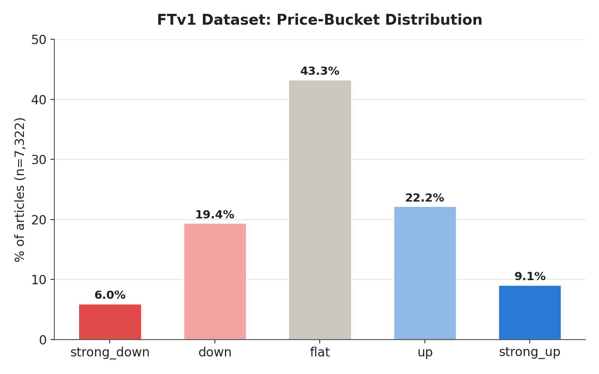
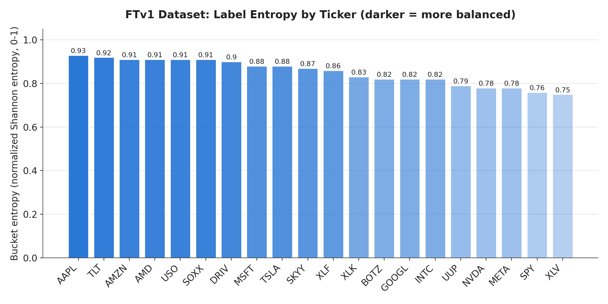

# FinCast FTv1: Fine-Tuning a Small Model to Predict Stock Moves on a Gaming Laptop

## Motivation

I wanted to fine-tune a small open-source model to predict next-day stock movement from news and price data — and I wanted to do it end-to-end, entirely on my own laptop. No hosted API, no cloud GPU rental. Just a Phi-3-mini model, an RTX 4050 with 6GB of VRAM, and whatever creativity that constraint forced on me.

This wasn't really about beating the market — and it's worth saying plainly up front, since it shapes how to read everything that follows: the goal was never to build a perfect market prediction model. It was to see what a small model could learn from a genuinely modest amount of signal — a handful of news articles a day and the last five days of price action — and to actually build that pipeline with my own hands rather than read about it. As a Forward Deployed Engineer, I spend my days helping enterprises stand up production agentic systems — but there's a difference between architecting a pipeline on a whiteboard and living through the version where GDELT throttles you at 2am, your CSV parser silently mangles a tab-delimited file, and your model confidently predicts "up" for a ticker that just dropped 4%. I wanted the whole loop: collect data, label it, build a training set, fine-tune, evaluate, deploy live predictions, and then sit with the results long enough to find out where they lied to me.

What actually surprised me is that it went somewhere at all. Mixing a handful of news articles with a few days of price history and fine-tuning a small open model on a gaming laptop produced a model that showed real, if narrow, directional signal — not something I was confident going in that this scale of effort would produce. It hasn't seen a full market cycle yet, so there's plenty still to prove before I'd trust it with anything. But this post is less about the finished model and more about learning by doing — trying to make honest sense of what the model's behavior was actually telling me at each step, rather than assuming any of it meant more than it did.

So the goal was the full pipeline — data collection → labeling → training → evaluation → live prediction — built from scratch, on hardware modest enough that every design decision had a real cost attached to it.

---

## Data Collection & GDELT's Aggressive Throttling

GDELT's DOC API became my news source of choice — it does its own entity matching, which meant I didn't have to build fragile keyword logic to figure out whether an article was actually about NVIDIA or just mentioned it in passing. The catch: it throttles hard, and getting a nightly pull of 27 watchlist terms (companies, sectors, macro themes) through it reliably took several rounds of trial and error.

I went back and forth on the fetch strategy itself. Querying day-by-day felt safer at first — smaller requests, easier to reason about — but it multiplied my total request count and made the throttling worse. Switching to a single date-range query per topic cut the request count down, but early on I was still seeing repeated failures even with what felt like generous spacing.

The fix that actually moved the needle was a mix of three things: **long sleeps** between requests (well above GDELT's documented minimum, since the documented floor turned out to be more of a suggestion than a guarantee), **randomizing the order** topics were queried in each run, and treating catch-up as its own explicit pass rather than something that happened inline. Randomizing the order mattered more than I expected — when a run failed partway through, the same handful of topics (always near the end of a fixed list) kept losing out night after night. Shuffling meant that even a partially-failed run spread its misses around, and a second (and sometimes third) retry pass — after a real cooldown, not an immediate re-hit — usually caught whatever the first pass missed.

---

## Augmenting News with Price Data

News sentiment alone doesn't tell a model much without market context, so each row also carried the ticker's trailing 5-day price trend pulled from Yahoo Finance, alongside the news for that day. The idea was to give the model something to anchor "is this good news" against — a stock that's already been sliding for a week reacts differently to the same headline than one on a tear.

I deliberately kept this lean: no benchmark index (like QQQ) as a separate input feature, and no per-article LLM-computed comparison against a benchmark. Every added field competes for space in an already tight token budget on 6GB of VRAM, so news items per row got capped at 5, and the price context stayed to the plain trailing trend rather than anything more elaborate.

The more important fix here wasn't a new feature — it was a bug in how price moves got turned into labels. My original bucketing used fixed percentage thresholds (say, ±2%/±5%) applied the same way to every ticker. That works terribly across a watchlist with wildly different volatility profiles: a low-volatility ETF like SPY or XLF almost never moves ±2% in a day, so it landed in "flat" the vast majority of the time, while a name like TSLA or AMD spread naturally across every bucket. Same thresholds, very different amount of signal extracted. The fix was switching to volatility-normalized (z-score) bucketing — scoring a move by how many standard deviations it was from *that ticker's own* trailing volatility, not by a flat percentage. That one change did more to fix label balance than anything else in the pipeline.

---

## Notebooks, Analysis & Data Readiness

Before touching any model weights, I built an analysis notebook to actually look at what I'd collected — price-bucket distribution overall and per-ticker, a sentiment-vs-price mismatch confusion matrix, edge cases where bullish news coincided with a price drop, stock-vs-benchmark correlation, macro sentiment vs. individual stock moves, sector-vs-constituent correlation, and a couple of exploratory tests on whether volatility regime or article relevance tier affected how predictive sentiment actually was.

The headline number from the first pass was rough: 10 of 20 tickers came back flagged "HIGH FLAT" under the old fixed-threshold bucketing — meaning the labels for those tickers were so overwhelmingly "flat" that there was barely anything for a model to learn. After switching to the volatility-normalized bucketing described above and recomputing, that dropped to zero flagged tickers, with label entropy sitting near the theoretical max across the board. I also added an entropy-based balance metric here specifically because a flat-percentage threshold alone can miss a different kind of imbalance — a ticker skewed entirely toward one non-flat extreme instead of toward "flat" wouldn't have tripped the original check at all.

To be precise about scale here, since it's easy to conflate two different numbers: 8,773 is raw articles collected across the whole date range; the dataset that actually went into training and validation later was 1,225 rows, one per ticker-day after grouping multiple articles together.

Readiness varied a fair amount by ticker once I broke it down individually — 15 of 20 tickers came back "READY 200+" articles, 3 landed in a medium tier, and 2 (XLK, BOTZ) were flagged low-sample. Entropy per ticker ranged from AAPL at 0.93 down to XLV at 0.75 — still healthy, but a visible reminder that "the dataset overall looks balanced" can hide individual tickers that need more data before they're pulling their weight.

Worth being precise about what "balanced" means here, since entropy can sound like it's measuring several different things at once. This is entropy over the five price-bucket *labels* (strong_down/down/flat/up/strong_up) for a given ticker — purely a measure of how evenly that ticker's historical days spread across the five outcome classes. It has nothing to do with how the articles are spread across dates, and nothing to do with model predictions, since no model existed yet at this stage — this was a pre-training check on the training labels themselves. A ticker near the theoretical max entropy (like AAPL at 0.93) had its days spread fairly evenly across all five buckets; a ticker lower on the scale (like XLV at 0.75) had its days leaning more heavily toward one or two buckets, even after the volatility-normalization fix. High entropy is what you want here — it means the model actually sees enough examples of every outcome to learn the difference between them, rather than learning "just guess flat" because that's what worked 90% of the time in the raw data.

For actually reasoning about the results, I found it far more useful to export everything into one consolidated markdown file than to hand over a stack of CSVs — easier to paste into a chat and get a second opinion on. That export went through a couple of rounds of its own: an early version reused generic variable names across notebook sections, so a later section's reassignment silently overwrote an earlier section's numbers by the time the export ran — a genuinely sneaky bug, since nothing errored, the export just quietly reported stale values. I also trimmed it down from full verbatim article rows in the edge-case section to counts only, once it was clear the verbatim text wasn't adding anything for the data-quality read I actually needed.

The correlation numbers themselves came out weak almost everywhere — mostly r < 0.2 between sentiment and price move. Worth sitting with for a second: that's not automatically a data-quality failure. Markets are reasonably efficient, and a single pairwise correlation can't see the kind of nonlinear, multi-signal structure a fine-tuned model conditioning on several inputs at once might still pick up on. It was also a good reminder to watch for the multiple-comparisons trap — run enough correlation tests at p < 0.05 across sectors and volatility regimes, and a few "significant" hits show up by chance alone.

**So what did this analysis phase actually tell us?** Three things, in order of how much they changed what happened next. First, the label-balance problem was real and specific to using flat, non-ticker-aware thresholds — not a sign the news data itself was low quality. Second, weak sentiment-price correlation is expected and not disqualifying on its own; it just meant I couldn't rely on a single clean signal and needed to trust the fine-tuning process to find structure a correlation coefficient can't. Third, "dataset-wide" health metrics can and did hide ticker-level problems — the overall entropy looked fine, but XLK and BOTZ were quietly sitting on too little data to trust individually. All three of these directly shaped the training and evaluation decisions in the next two sections.

---

## The Fine-Tuning Code & Run Details

With the data in reasonable shape, the next call was whether to frame this as supervised fine-tuning or something more reinforcement-flavored. I went with SFT: the label for every row comes from an objective, already-known price outcome, not a preference signal that needs exploring — and RL-style methods tend to be more sample-hungry and more sensitive to reward noise, which mattered given how weak the raw sentiment-price correlations were. There wasn't a strong argument for the added complexity here.

The base model was `microsoft/Phi-3-mini-4k-instruct` — not the 128k-context variant, which I'd reserved separately for the sentiment-scoring step where full articles needed reading. Training rows themselves only ran 400–600 tokens, so 4k context was plenty. To make this fit in 6GB of VRAM, I used QLoRA: 4-bit NF4 quantization with double quantization, LoRA rank 16 / alpha 32, gradient checkpointing, and 8-bit paged AdamW. One detail worth calling out for anyone trying this on a different base model: Phi-3's attention and MLP projections are fused (`qkv_proj`, `gate_up_proj`, etc.) rather than split into separate `q_proj`/`k_proj`/`v_proj` modules the way many other architectures are — get the target-module names wrong and LoRA silently attaches to nothing, no error, just a fine-tune that doesn't actually learn anything. I also used completion-only loss masking, so gradient signal focused on the JSON output tokens rather than being diluted across the prompt.

The final dataset split 1,225 rows into 1,068 training and 157 validation examples — split by date rather than by row, specifically to keep near-duplicate same-day entries from leaking across the boundary. The run itself took about 2.2 hours wall-clock, with early stopping kicking in around epoch 4.12 (step 275 of a planned 528) after the best validation loss (0.1558) actually landed earlier, around epoch 2.62 — restoring that best checkpoint rather than the later, worse one it would've saved by default.

None of this ran cleanly on the first try. An undeclared dependency (`rich`, needed by `trl` but not listed anywhere) took a moment to track down, and a more subtle bug came from running two separate project folders with two separate virtual environments — a relative adapter path resolved differently depending on which folder happened to be the working directory at runtime, surfacing as a confusing low-level error three layers down in the `peft` library rather than a clear "wrong path" message. Making the adapter path absolute, and anchoring config loading to the script's own location instead of the current working directory, fixed it for good.

*(One thing I didn't capture this round: a per-epoch training/eval loss curve. The training log had the numbers, but I hadn't wired up chart-worthy logging for it yet — that's on the list for FTv2.)*

---

## Predictions & Prediction Analysis

With training done, the last piece was watching the model predict something and checking it against reality — not just reporting a validation loss. Three scripts closed the loop: one to generate today's live prediction per ticker (reusing training's exact payload-construction logic to avoid train/serve mismatch), one to reconcile each prediction against the actual outcome once the next day's price settled, and one to eval against the held-out validation set. All three got wired into the nightly pipeline.

Here's the full forward-test result, reconciled across the run window **07/29/2026 – 08/20/2026**, 163 predictions across 19 tickers:

**Overall: 35/163 exact = 21.5% · 67/163 direction = 41.1%**

| Ticker | n | Exact % | Direction % |
|---|---|---|---|
| NVDA | 12 | 8.3 | 33.3 |
| XLV | 12 | 25.0 | 25.0 |
| AAPL | 11 | 0.0 | 18.2 |
| AMZN | 11 | 18.2 | 36.4 |
| SPY | 11 | 18.2 | 27.3 |
| AMD | 10 | 10.0 | 60.0 |
| GOOGL | 10 | 30.0 | 60.0 |
| META | 10 | 20.0 | 40.0 |
| TLT | 9 | 22.2 | 22.2 |
| TSLA | 9 | 33.3 | 55.6 |
| INTC | 8 | 25.0 | 37.5 |
| SOXX | 8 | 12.5 | 50.0 |
| USO | 8 | 12.5 | 50.0 |
| UUP | 8 | 50.0 | 50.0 |
| XLF | 8 | 37.5 | 50.0 |
| MSFT | 7 | 42.9 | 57.1 |
| SKYY | 7 | 14.3 | 28.6 |
| DRIV | 3 | 33.3 | 66.7 |
| BOTZ | 1 | 0.0 | 100.0 |

**What this actually tells us:**

- **Direction accuracy (41.1%) is close to the 33.3% you'd get guessing blind across three directions (down/flat/up)** — better than chance, but not by a wide margin at this sample size. This is a meaningfully more honest baseline than the one used in an earlier, smaller review, which had compared against a look-ahead "actual majority" number rather than something a live model could actually beat in advance.
- **The spread across tickers is the real story, not the average.** AMD, GOOGL, MSFT, TSLA, and the DRIV/XLF/SOXX/USO/UUP cluster all sit at 50–67% direction accuracy — genuinely above the coin-flip-adjusted baseline. AAPL (18.2%), TLT (22.2%), and XLV (25.0%) sit well below it. That's not a uniform "the model is 41% good" — it's a model that's doing something real on a subset of tickers and close to guessing on others.
- **Exact accuracy consistently trails direction accuracy by a wide margin** (21.5% vs. 41.1% overall, and every single ticker row shows the same gap) — the model tends to get the side of the move right more often than the magnitude, which lines up with the "magnitude confusion" pattern flagged in the earlier structured review.
- **n matters a lot here — BOTZ's 100% is 1 prediction, not a signal.** DRIV's 66.7% is 3. Treat anything under ~8 predictions as a data point to watch, not a conclusion to draw. NVDA, AAPL, SPY, and XLV are the only rows with enough volume (11-12) to say anything with real confidence, and none of them look strong.

This is the number the model was actually taking into FTv2: a real but narrow directional edge, concentrated in a handful of tickers, with magnitude still mostly unresolved.

---

## Closing Thoughts

That's where FTv1 leaves off. It's a small, imperfect, but genuinely working pipeline — one that produced a model showing a real, if narrow, directional edge on a subset of tickers, built entirely on a gaming laptop with a handful of daily news articles and five days of price history. It hasn't seen a full market cycle, the magnitude side of predictions is still mostly unresolved, and there's a longer list of rough edges than what's covered here.

Those rough edges — along with the fixes and the improvements they led to — are the subject of Part 2.
